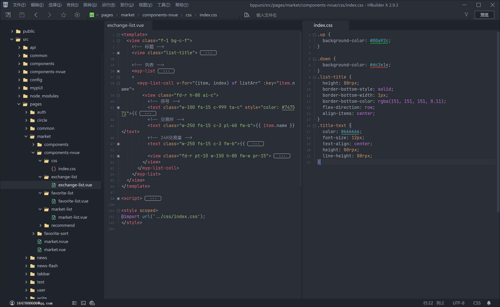

# markrgba-css

## 1️⃣ 简介

Github：[https://github.com/SunSeekerX/markrgba-css](https://github.com/SunSeekerX/markrgba-css)

原作者：[https://gitee.com/CLQing/MarkrgbaCss_UniApp](https://gitee.com/CLQing/MarkrgbaCss_UniApp)

这是一些 css 的简写类名的库，用于开发 uni-app。适用于 vue+nvue 文件。

在写代码的过程中，写 css 是非常头疼的事情，例如：

1. **命名**；这应该是所有程序员的痛。
2. **写 dom 不能直接写 css**；html 和 css 通常不在一块，需要滑动很长才能找到 css 定义的地方。
3. **很多重复定义**；像 `diaplay: flex;` 这样的代码在 css 中写了太多太多

想写的标准规范。找了 bem 规范，实际用起来非常不方便。因为是结合 scss，如果我用了 & 那我我在文档中搜索 css 定义的地方非常不方便。

偶尔发现了类似 `fd-r pt-10 w-150 h-80 fw-w pr-15` 这样的写法。一开始看起来非常的乱，无法维护。

当我理解了之后真香！这就是经验的结晶。上面的意思是

```scss
.fd-r {
  flex-direction: row;
}
.pt-10 {
  padding-top: 10rpx;
}
.w-150 {
  width: 150rpx;
}
.h-80 {
  height: 80rpx;
}
.fw-w {
  flex-wrap: wrap;
}
.pr-15 {
  padding-right: 15rpx;
}
```

现在我的代码：



## 2️⃣ 快速上手

**安装**

```bash
npm i @limm/markrgba-css
# or yarn
yarn add @limm/markrgba-css
```

**在 uni-app 页面中使用**

`${app}/App.vue`

推荐全部引入，开启 `treeshaking` 会自动裁剪没有用到的类

```scss
@import '@limm/markrgba-css';
```

**使用**

就是简介图上直接添加 class 就行了。

## 4️⃣ class

|           |                           |     |
| :-------: | :-----------------------: | :-: |
| .bw-${x}  |    border-width: xpx;     |     |
| .bw-${x}r |    border-width: xrpx;    |     |
| .btw-${x} | border-top-width: ${x}px; |     |

## 5️⃣ 更新日志（CHANGELOG）

### 0.7.0

**功能（Features）**

- 增加 `z-1` 到 `z-100` 的 `z-index: n;` 类

### 0.5.0

#### BREAKING CHANGES

- w-xp => wp-x
- 移除 nvue 直接引入就能使用
